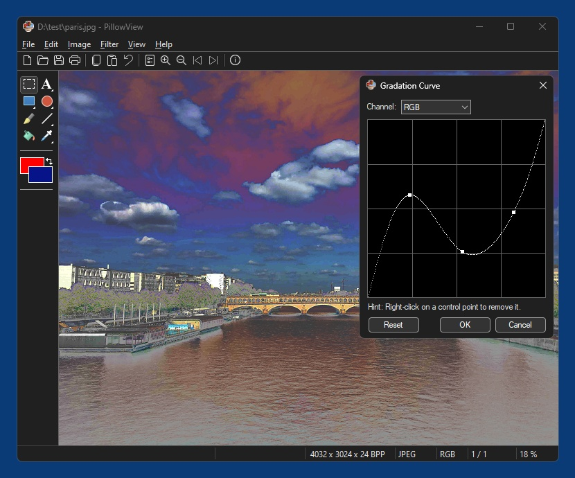

# PillowView

A free and open source image viewer and simple image editor for Windows 10/11 x64 written in Python, based on [Pillow](https://python-pillow.github.io/) and native Windows APIs. Might also be called a Pillow GUI for Windows. Heavily inspired by [IrfanView](https://www.irfanview.com/).

PillowView in Windows 11 (dark mode)

## Features

- Read/write support for various image file formats, including animation formats
- Basic image editing features, like color corrections, filters, effects...
- Relatively small and fast
- Dark mode support
- Portable (no setup needed, but writes settings to key in registry)
- Extensible by plugins (see below)

## Supported image file formats

### Core app
- AVIF (read/write)
- BLP (read/write)
- BMP (read/write)
- CUR (read)
- DCX (read)
- DDS (read/write)
- DIB (read/write)
- FITS (read)
- FLI/FLC (read)
- FPX (read)
- FTEX (read)
- GBR (read)
- GIF (read/write)
- ICNS (read/write)
- ICO (read/write)
- IM (read/write)
- IPTC/NAA (read)
- JPEG (read/write)
- JPEG2000 (read/write)
- MSP (read/write)
- PCD (read)
- PCX (read/write)
- PDF (write - read support via ghostscript plugin)
- PIL (read/write)
- PIXAR (read)
- PNG (read/write)
- PPM (read/write)
- PSD (read)
- QOI (read/write)
- RAW (read/write)
- SGI (read/write)
- SUN (read)
- TGA  (read/write)
- TIFF (read/write)
- WAL (read)
- WEBP (read/write)
- WMF/EMF (read)
- XBM (read/write)
- XPM (read)

### Via Plugins (read only)
- AI (Adobe Illustrator)
- Camera RAW formats (many)
- CDR (CorelDraw)
- EPS/PS
- FH/FHx (Macromedia FreeHand)
- MNG
- ODG (LibreOffice/OpenOffice Draw)
- PDF
- PICT (Mac Pict)
- SVG
- Video file formats (many)

### Animation formats
- AVIF
- FLI/FLC
- GIF
- PNG/APNG
- WEBP

### Multi-page/multi-size formats
- ICNS
- ICO
- PDF
- TIFF
- Video file formats (many)

## Plugins

### dcraw
Read support for various Camera RAW Formats, based on [dcraw](https://github.com/ncruces/dcraw).

### ffmpeg
Import frames from video files as images via [FFmpeg](https://www.ffmpeg.org/) (requires [ffmpeg.exe](https://www.gyan.dev/ffmpeg/builds/)).  
There is no video player (pointless), instead video files are opened as virtual multi-frame images.

### freeimage
Read-only support for additional file types PICT, MNG and 48/64/96/128-Bit PSD/TIFF, based on [FreeImage](https://freeimage.sourceforge.io/).  

### ghostscript
Encapsulated Postscript (EPS) read/write, Adobe Illustrator (AI) read and PDF read support, based on [Ghostscript](https://ghostscript.com/index.html).

### jpeg-transform
Lossless JPEG transformations, based on [jpegtran](http://sylvana.net/jpegcrop/).

### libreoffice
CorelDraw (CDR), Macromedia FreeHand (FH/FHx) and OpenDocument Graphic (ODG) read support, based on headless LibreOffice Draw (requires [LibreOffice](https://www.libreoffice.org/))

### ocr
Optical character regognition (OCR) based on [Tesseract](https://tesseract-ocr.github.io/) (requires [tesseract.exe](https://github.com/tesseract-ocr/tesseract/releases)).

### paint
Paint Toolbar for drawing shapes, lines, arrows and text.

### scanner
Scanning support using the [TWAIN](https://en.wikipedia.org/wiki/TWAIN) API, based on [pytwain](https://pytwain.readthedocs.io/en/latest/). Works fine in combination with [VueScan](https://www.hamrick.com/).

### svg
SVG read support, based on [CairoSVG](https://cairosvg.org/).

### wpd
Take and import a picture from a digital camera connected via USB using the [Windows Portable Devices (WPD)](https://learn.microsoft.com/en-us/windows/win32/windows-portable-devices) API. Only supports cameras that implement the WPD_FUNCTIONAL_CATEGORY_STILL_IMAGE_CAPTURE feature. Since recent Windows Explorer does a good job concerning browsing the storage of connected WPD devices, this plugin does not try to replicate this feature, it's only meant for taking pictures.
